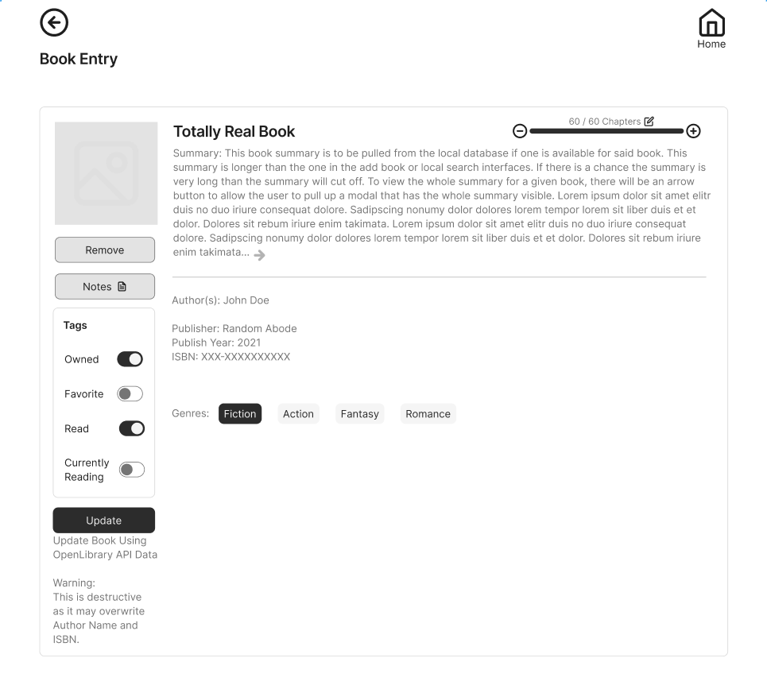

# 2.3 - Frontend for Individual Book Page

Note: This is only mockup it does not need to look like this. It only needs to have the visible functionality.

### Main Objectives:
Create the frontend for individual book result. Do not have to program the scripting yet for receiving information via
a route with a GET request (this will added next sprint).

Must have:
- [ ] Back Button that goes to results page again
- [ ] Home Button
- [ ] Page header with something like "Book Entry"
- [ ] Remove Button
  - Design Note: This button will be used to delete a book record from the database. We will add a modal warning later
  when the user clicks the button.
- [ ] Notes Button
  - Design Note: This will later link to the Notes page for the book.
- [ ] Update Button
  - Design Note: This will be used to update a locally added book entry with OpenLibrary data. Will have a modal added
  later warning the user when clicked.
- [ ] Chapter Update Controls:
  - Design Note: Must include functionality of editing total chapters and decrementing and incrementing chapters. Do
  not worry about scripting at this time. 
- [ ] Book Data Placeholders:
  - [ ] Book Title
  - [ ] Chapters:
    - [ ] Total Chapters
    - [ ] Read Chapters
  - [ ] Book Summary
    - Design Note: If there is no summary, have a default insert telling the user that they can add one through
    updating the book data through OpenLibrary. There is a small chance that an entry in OpenLibrary does not have a
    summary too. Do not worry about this right now, there is a solution that will be implemented when we add scripting.
  - [ ] Author(s)
  - [ ] Publisher
  - [ ] Year Published
  - [ ] ISBN
  - [ ] Genres:
    - [ ] Genre_1
      - Design Note: Genre_1 will always be available for a book entry since it denotes either fiction or nonfiction.
      Also, make sure to make Genre_1 more prominent of the 4 genres.
    - [ ] Genre_2 (if available in result)
    - [ ] Genre_3 (if available in result)
    - [ ] Genre_4 (if available in result)
  - [ ] Tags:
    - [ ] Owned
    - [ ] Favorite
    - [ ] Read
    - [ ] Currently Reading