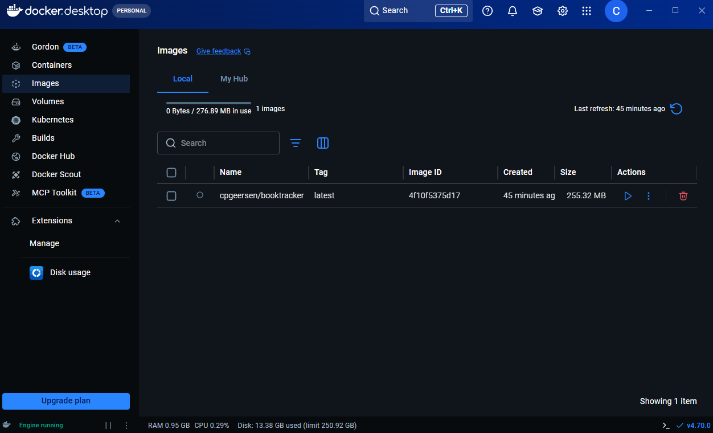
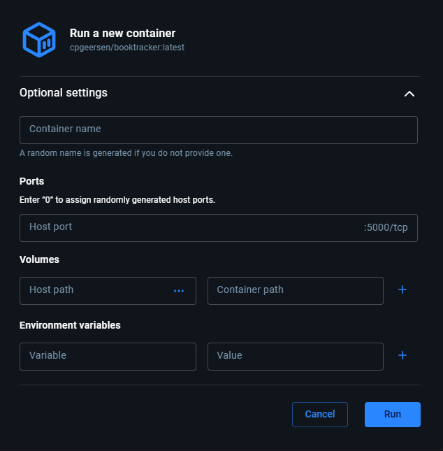
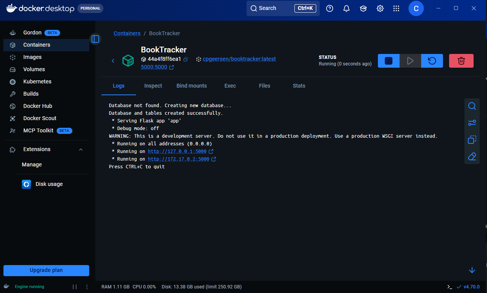
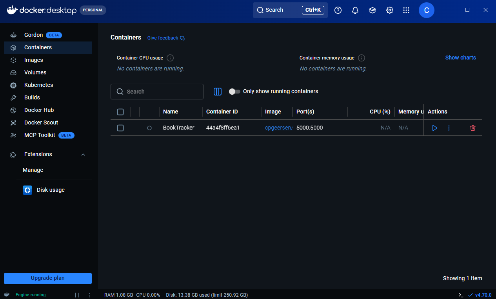

# CSC289 Programming Capstone Project


Project Name: Book Tracker

Team Number: 2

Team Project Manager: Collin Geersen

Team Members: Joseph Candleana, Collin Geersen, Mireliz Gimenez, Holly Green, Nicholas Grudier, Christopher O'Brien

 

## Software Installation Guide: BookTracker


### Introduction

This guide provides the necessary steps to install and access the Book Tracker application from its official 
GitHub release. It outlines system requirements, prerequisites, and clear instructions to help users set up the 
software quickly and smoothly.

## Python Wheel

### System Requirements

**Operating System**: Windows 10+, macOS, or Linux

**Python Version**: Python 3.9

**CPU**: Any modern CPU

**RAM**: 4 GB

**Disk Space**: 200 MB

**Internet Connection**: Required for some features


### Downloading the Installer

The Book Tracker application is distributed as a wheel file, which contains the packaged version of the software ready for installation. Users can download the installer directly from the official GitHub release page:

GitHub Release (Version 1.0.0):  
https://github.com/cpgeersen/Book-Tracker/releases/tag/1.0.0

On the release page, scroll to the Assets section and download the file labeled: **Book-Tracker-1.0.0.whl**

This wheel contains the full application package. 


### Installing the Software

## 1. Locate the Downloaded Wheel File
After downloading, navigate to the folder where the file was saved.
The file: book_tracker-1.0.0-py3-none-any.whl

## 2. Open a Terminal or Command Prompt

Windows: Press Win + R, type cmd, and press Enter

macOS: Open Terminal from Applications → Utilities

Linux: Open your preferred terminal application

## 3. Navigate to the Folder Containing the Wheel File
Use the cd command to move into the directory where the wheel file is located. For example:
**cd Downloads**

**Tip:** Create a separate folder to put the wheel in to install.

## 4. Install the Application Using pip
Run the following command:

```commandline
    pip install book_tracker-1.0.0-py3-none-any.whl
```

### Launching the Software

## Navigate to the Project Directory
Open a terminal or command prompt and move into the folder where your application files are located. For example:

```commandline
    cd path/to/book-tracker
```

## Run Flask

```commandline
    python -m flask run
```

## Access the Application
Open a web browser and go to:
**http://localhost:5000**

Your Book Tracker app will now be running and accessible.

### Uninstalling the Software
If you no longer need the Book Tracker application, you can remove it easily using pip. Uninstalling the software will remove the installed package and its associated files from your Python environment.

1. Open a Terminal or Command Prompt:

Windows: Press Win + R, type cmd, and press Enter

macOS/Linux: Open Terminal

2. Uninstall the Book Tracker Package:
Run the following command:

    ```commandline
        pip uninstall book_tracker-0.1.0-py3-none-any.whl
    ```


## Docker Image

Docker is a software the offers a virtualization platform that allows app to be put into containers
to run an application in a controlled an isolated state. If a user can install docker, then the application
is supported on the device.

### System Requirements

**Docker**: Must be able to install docker Link: https://www.docker.com/get-started/

**CPU**: Any modern CPU

**RAM**: 4 GB

**Disk Space**: 300 MB

**Internet Connection**: Required for some features

### Downloading or Creating the Docker Image

A user can either download a premade image from Docker Hub or they can create their own from the provided
Docker File in the source code.

#### Downloading and Installing From Docker Hub

**Assumes one already installed Docker**

1. Go to the Docker Hub Page
    https://hub.docker.com/r/cpgeersen/booktracker

2. Copy the pull command and use in a command line:
```commandline
docker pull cpgeersen/booktracker
```

Now you have the BookTracker Docker Image Installed


### Installing the Docker Image from the Dockerfile

**Assumes one already installed Docker**

To create your own image you can run the following command in a command line
when pointing to a folder with the download source code.

```commandline
docker build -t booktracker:latest .
```

Now you have the equivalent to the Docker Image on Docker Hub.

### Launching the Docker Image

It is recommended to use Docker Desktop for the following steps:

1. You should see something like this in the Docker Desktop Images tab:



2. Now click the little play button under the actions column:

    This should show a menu, click on the optional settings. We will be changing some settings.
    Failing to do so can prevent the app from launching correctly.

    You should see something like this:
    

3. Now enter the following optional settings:
    - **Container Name**: Can be anything, we recommend 'BookTracker'\
    - **Host Port**: We recommend port 5000, other port numbers may conflict and flask's default is 5000
    - **Volumes**: Currently, not support. Future versions will implement proper volumes.
    - **Environment Variables**: Not used, all environmental variables are created.

4. Click Run

    You should see something like this:
    

5. Go to **http://localhost:5000**
    
    The app will now display in a browser.
6. When you are done, click the stop button
7. When you want to use it again, go to the containers tab
    
    You should see something like this:
    

8. Click on the play button to repeat the process of using the app.


**Warning: Make sure not to create a new container from the image, they do not share storage.**

**Warning: If updating make sure to export your database, you can lose your database since volumes 
are not supported at this time.**

### Uninstalling the Dock Image
To uninstall the app just delete the container created from the image and then delete the image.
This is all easily accomplished in the Docker Desktop app by clicking on the Trashcan icons.

### Troubleshooting

***Issues with using the Docker Image from Docker Hub:***

If you are having issues with the Docker Image from Docker Hub, creating your own image from the
Docker file from the source code should fix this.

### Support and Contact Information

If you are having any issues reach out through the GitHub repo or by emailing Collin Geersen
at cpgeersen@my.waketech.edu

