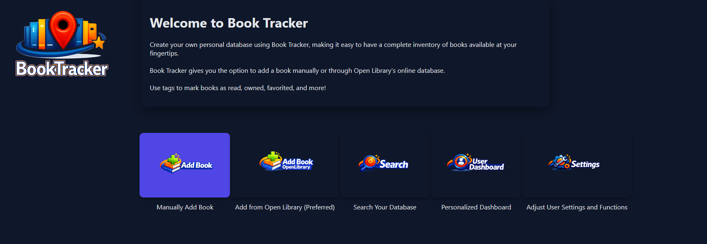
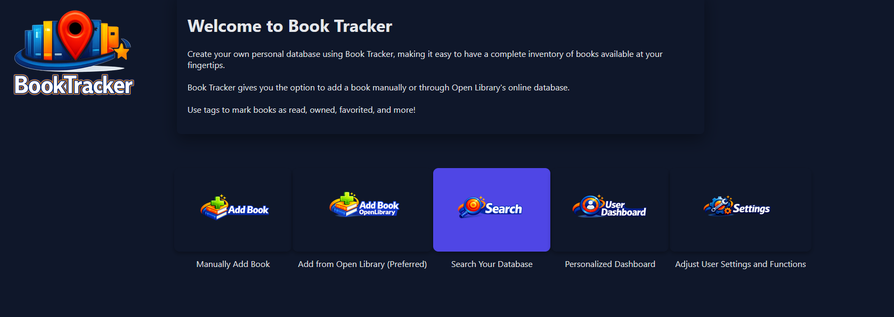
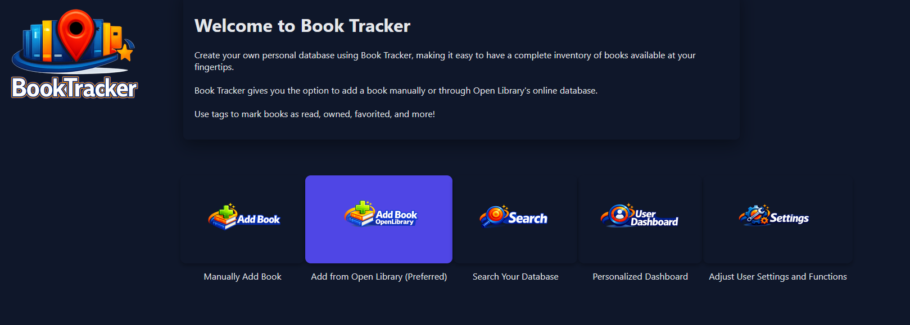
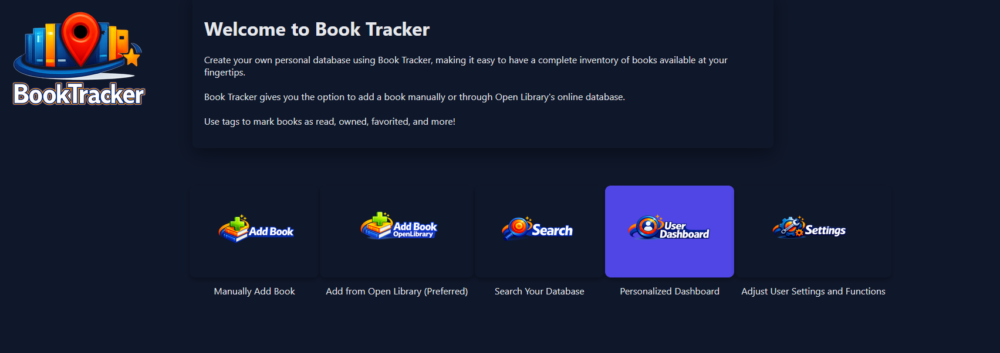
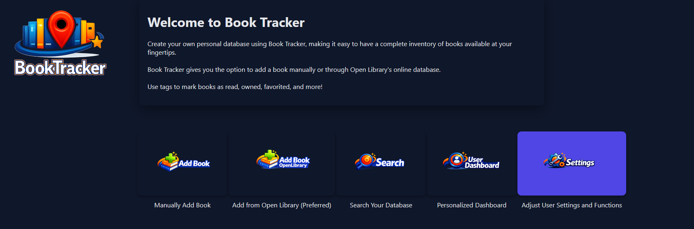

# CSC289 Programming Capstone Project

Project Name: BookTracker

Team Number: 2

Team Project Manager: Collin Geersen

Team Members: Joseph Candleana, Collin Geersen, Mireliz Gimenez, Holly Green, Nicholas Grudier, Christopher O'Brien

## BookTracker User Manual

### Introduction:

The BookTracker application is a Python based local database app that is built in the flask framework. The user can
pick between two main ways to install the application. Each have their own requirements and trade-offs. More 
specific information can be found in the installation guide.

The purpose of this application is to provide a feature rich database software that allows a user to maintain
a backlog of books using tagging and genre capabilities through a graphical user interface. With any avid reader, 
trying to properly track what books you own or what book to read, can be a problem. This application helps to solve this issue. 
While there are other online websites that have the same features, this is fully controlled by the user. 
All data is theirs.

### Getting Started:

#### Install The Application

Users can download the latest version of the BookTracker app from the official GitHub release page or use the
Docker Image found on Docker Hub:

GitHub Release (Python Wheel):  
https://github.com/cpgeersen/Book-Tracker/releases/tag/1.0.0
Download the ZIP and extract them to the location of your choice.

Docker Hub Image:
https://hub.docker.com/r/cpgeersen/booktracker

---

#### Python Wheel System Requirements

**Operating System**: Windows 10+, macOS, or Linux

**Python Version**: Python 3.9

**CPU**: Any modern CPU

**RAM**: 4 GB

**Disk Space**: 200 MB

**Internet Connection**: Required for some features

---

#### Docker Image System Requirements

**Docker**: Must be able to install docker Link: https://www.docker.com/get-started/

**CPU**: Any modern CPU

**RAM**: 4 GB

**Disk Space**: 300 MB

**Internet Connection**: Required for some features 

---

### Features Overview:

Main Features:
- Add a book with local data
- Add a book with OpenLibrary data (search off of ISBN, title, and author)
- Can update an existing locally created book with OpenLibrary data
- Search for a book (ISBN, title, author) with rich filtering
- A separate book page for every entry
- Can add/delete cover images
- Can add/delete a summary
- Can edit and track user completed chapters
- Can add and delete genres for a book
- Can toggle tags for: owned, favorite, currently reading, complete, and personal or academic
- Can add/edit/delete user notes
- Can delete a book
- Dashboard that shows: number of owned books, number of books in database, list of completed or currently reading,
and the five most common genres in the database.
- A user setting for username and themes
- A way to export/import the database into CSV
- A UI to detect duplicate books (same book different ISBN)
- Mass delete of database and cover images
- In-app help on every page

### Using BookTracker:

---

#### Adding a Book

1. Click on the highlighted `Manually Add Book` element

2. Fill out the form for a new book

3. This will bring you to the book page for the newly added book

---

#### Searching a Book

1. Click on the highlighted `Search Your Database` element

2. Using the search box input the desired ISBN, title, or author

3. Additionally, use the filters on the side to further narrow down your search

---

#### Viewing a Book
To view a book use the local search feature discussed prior and click on the
view book button for the respective book

---

#### Edit/Delete Cover Image
Given you are on the respective book page, you can add or delete a book cover by clicking on the edit button.

---

#### Edit/Delete Book Summary
Given you are on the respective book page, you can add or delete a book summary by clicking the edit button.

---

#### Edit Book Chapters
Given you are on the respective book page, you can edit the number of chapters and chapters completed by clicking
on the edit button.

---

#### Edit/Delete Book Genres
Given you are on the respective book page, you can add or delete genres by clicking on the edit button.

---

#### Edit Book Tags
Given you are on the respective book page, you can toggle the tags by clicking on them.

---

#### Edit/Delete Notes
You can add, edit and delete a books notes. This is found for the respective book page.

---

#### Deleting a Book
At the bottom of a given individual book page, click the delete button to delete.

---

#### Updating a Book with OpenLibrary Data
At the bottom of a given individual book page, click the Update with OpenLibrary Data button.

Confirm whether or not you also want to update the cover image and summary.

---

#### Adding a Book with OpenLibrary Data
1. Click on the highlighted `Add from Open Library (Preferred) ` element

2. In the search box, search either by ISBN, title, or author

3. Click on the Add Book button to add the book to the user Database

---

#### Analytics Dashboard
1. Click on the highlighted `Personalized Dashboard` element

2. View your stats

---

#### User Settings
1. Click on the highlighted `Adjust User Settings and Functions` element

2. With this page you edit your settings

3. You can also export and import your database

4. You can also delete your entire database

5. You can also delete all cover images

6. You can also deduplicate books that are listed under different ISBNs

---   

#### In-App Help
Pages have an in-app help feature, just click on the button on the top of pages.

 
---

#### Changing Theme
You can also change the UI theme on most pages by clicking the change theme button on the
top of the page.

### Troubleshooting:

- **Tip**: If an author uses letters in their name like J.R.R Tolkien, make J.R.R their first name.

- **Tip**: If an author uses a middle name, include it in the firstname or drop it
(this will be fixed if updated via OpenLibrary data).

- **Tip**: When searching for authors, try to search by full name (though single last names are supported).

- **Tip**: When searching titles, be less generic for the best results. Single word searches that are not allowed 
(for being too generic) are: 'the', 'a', 'and', 'be', 'that', 'of', 'this', and 'by'.

- **Tip**: Use the first line of the note to act as a title.

- **Tip**: When you create a note you will notice a Note ID, this can help with tracking notes.

- **Tip**: Be advised that searching by ISBN is the preferred method. Books can have a lot of overlap with
titles and author names.

- **Tip**: Searches can take sometime (especially none ISBN searches), give it a second to find the information
via the API. Though re-searching will be faster since there is a cache.

- **Tip**: If there are search issues, it can be beneficial to try again later or delete the cache since
OpenLibrary could have updated information since the last time searched.

- **Tip**: If you do need to use this emergency back-up, you will have to use your file explorer.
First rename the back-up to 'bt.db' and copy-paste the back-up to the folder where 'bt.db' resides
and overwrite with the back-up.

- **Issue**: OpenLibrary does not have a book being sought.
  - **Solution**: First, try a specific ISBN search. If that does not yield the book wanted, try other ISBNs for
  different editions of the same book. If this still does not work, try again later after clearing the
  OpenLibrary cache. If finally this also does not work, use your own local data for a book.

- **Issue**: Sometimes results for title and author searches do not return what would be expected.
  - **Solution**: No direct one since it is a limitation of the API. This comes from the fact that
  information is limited to the first five results being pulled to prevent spamming the API. In these cases use an ISBN.

- **Issue**: OpenLibrary ISBN search does not return a result.
  - **Solution**: This means that the OpenLibrary is missing that specific ISBN or that the information pulled is
  incomplete and cannot be used for the database. If this happens try finding a different ISBN and using that number.

- **Issue**: User adds two different versions of the same book (different ISBN)
  - **Solution**: Use the provided deduplication function found in the user settings page.

  
### Frequently Asked Questions (FAQs)

---

**Q**: How can I install the application? 

**A**: Refer to the Installation Guide.

---

**Q**: How can I change a book's cover image manually? 

**A**: Navigate to the book's page. Click the **Edit Cover Image** button.
Select **Choose File**. Choose desired image from the file picker window that appears and click Open.
The file picker window disappears.Select **Upload** to finish updating cover image.

---

**Q**: How can I back up my database?

**A**: You can export/import your database as a CSV by using the functions found in the user settings page.
Note: Currently cover images are not backed up.

---

**Q**: Can I use the OpenLibrary API too much, i.e. get banned?

**A**: No, there are protections against this to prevent spamming the API.

---

**Q**: What if I find a bug or think if a new feature?

**A**: Reach through the GitHub repo or email Collin Geersen at cpgeersen@my.waketech.edu

---

### Support and Contact Information:

If you are having any issues reach out through the GitHub repo or by emailing Collin Geersen
at cpgeersen@my.waketech.edu
